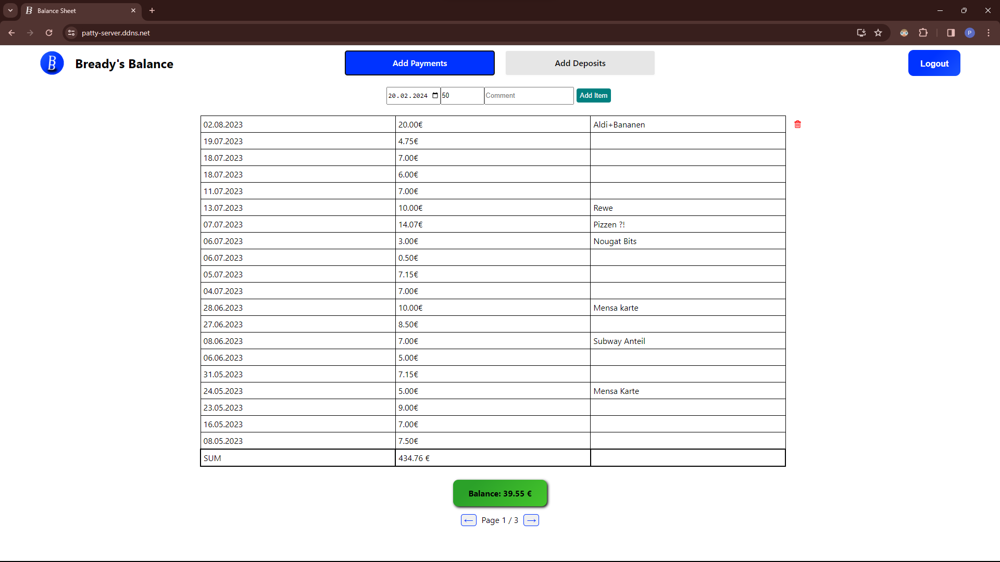

# Balance Sheet Web App
It's a web application which keeps track of your payments and earnings.



This project was bootstrapped with [Create React App](https://github.com/facebook/create-react-app).

## Setup

To get the frontend and backend running, you need to supply the file `src/res/config.json` file of the following structure:

```
{
    "apiAddress" : "[Server URL]",
    "apiPort" : [Backend Port],
    "privateKeyPath" : "[Path_to_privkey.pem]",
    "certificatePath" : "[Path_to_cert.pem]",
    "paymentFile" : "/var/www/db/paymentData.json",
    "depositFile" : "/var/www/db/depositData.json",
    "databaseFile": "/var/www/db/database",
    "itemsPerPage": 20
}
```

Certificate files and Privatekey files need to be supplied.

## Front End

In the project directory, you can run `npm start` to start the frontend of the app in the development mode.\
Open [http://localhost:3000](http://localhost:3000) to view it in your browser.

## Back End

In the directory 'src/backend/' you can run the command `node index.js` to start the back end service that serves the API requests.

## Demo

A working demo of the webapp can be found at [https://patty-server.ddns.net/](https://patty-server.ddns.net/)

